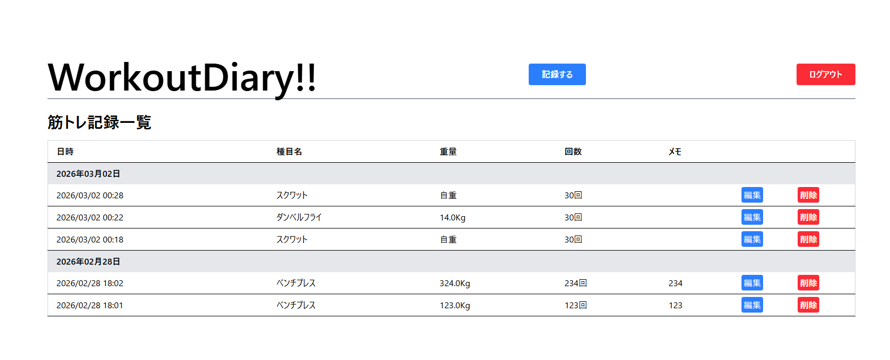
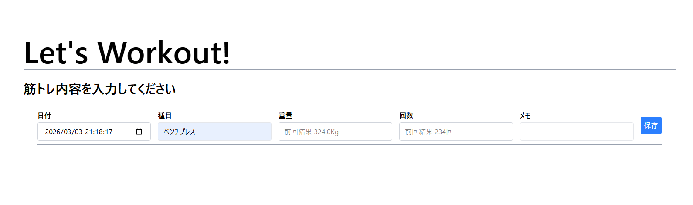

 Workout Records App
 
 ## 概要
ユーザーが筋トレ記録を簡単に管理できる Rails アプリです。  
- 日々のトレーニング記録（種目、重量、回数、メモ）を記録  
- 各種目ごとの **前回記録を参照** 可能  
- ユーザー認証付きで自分のデータだけ管理

- **バックエンド**: Ruby on Rails 8, Devise（認証）  
- **フロントエンド**: HTML, CSS, TailwindCSS, JavaScript  
- **データベース**: PostgreSQL  
- **その他**:  Git GitHub 

##  主な機能

### ユーザー認証
- サインアップ / ログイン / ログアウト  
- 自分のデータのみ操作可能  

### 筋トレ記録管理
- 記録の作成、編集、削除  
- 前回の記録を自動取得して表示  

- 日別・種目別で記録を一覧表示  
